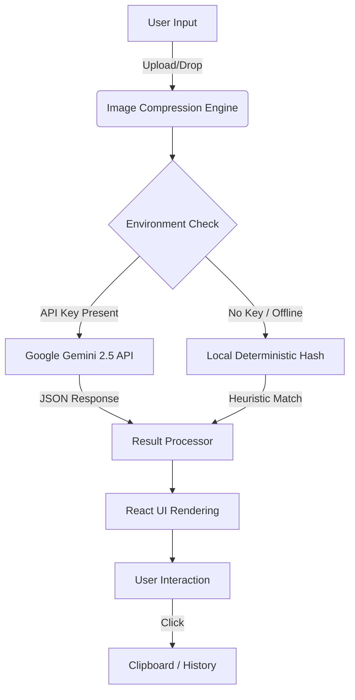

<div align="center">

  <!-- PROJECT LOGO -->
  <br />
  <div style="background: linear-gradient(to bottom right, #064e3b, #000000); padding: 20px; border-radius: 20px; width: 100px; height: 100px; display: flex; align-items: center; justify-content: center; margin: 0 auto; box-shadow: 0 0 50px rgba(16, 185, 129, 0.2);">
    <span style="font-size: 120px;">⌬</span>
  </div>

  <h1 style="font-size: 3rem; font-weight: 800; letter-spacing: 0.2em; margin-top: 20px;">
    SYMBOLIZE <span style="color: #10b981;">//</span> CIPHER
  </h1>

  <p style="font-size: 1.2rem; color: #94a3b8; max-width: 600px; line-height: 1.6;">
    Advanced AI-Powered Optical Character Recognition for Unicode Glyphs.
    <br/>
    <em>"Transforming analog geometry into digital semantics."</em>
  </p>

  <!-- BADGES -->
  <p>
    <a href="https://github.com/cipher-attack/symbolize/stargazers">
      
    </a>
    <a href="https://github.com/cipher-attack/symbolize/network/members">
      
    </a>
    <a href="https://github.com/cipher-attack/symbolize/issues">
      
    </a>
    <br/>
    
    
    
    
  </p>

  <br />

  <a href="#demo"><strong>View Demo</strong></a> · 
  <a href="#architecture"><strong>System Architecture</strong></a> · 
  <a href="https://github.com/cipher-attack/symbolize/issues"><strong>Report Bug</strong></a>
  
</div>

<br /><br />

<!-- INTRODUCTION -->
## ⌬ System Overview

**Symbolize** is not just an image recognizer; it is a sophisticated pattern matching engine designed to bridge the gap between visual sketches and digital typography. Built with the **Cipher Design Language**, it offers a stealthy, high-precision interface for developers, mathematicians, and designers.

Leveraging **Google's Gemini 2.5 Flash**, the system analyzes pixel data to infer semantic meaning, returning the most probable Unicode characters. It features a robust **Offline Fallback Engine**, ensuring functionality even in air-gapped environments.

---

## ⚡ Key Capabilities

| Feature | Description |
| :--- | :--- |
| **🤖 Neural Analysis** | Utilizes Multimodal LLMs to decode complex shapes into HTML Entities & Unicode. |
| **🛡️ Resilient Offline Mode** | Deterministic hashing algorithm provides symbol matching without Internet access. |
| **🌑 OLED Stealth UI** | True Black (`#000000`) interface optimized for efficiency and visual comfort. |
| **🌐 Universal Deploy** | Engineered to run on Vercel, Netlify, GitHub Pages, or Docker containers seamlessly. |
| **🎨 Cyber Aesthetics** | Glitch effects, magnetic buttons, fluid typography, and glassmorphism. |
| **📱 Responsive Matrix** | Adaptive grid layout that reconfigures for Mobile, Tablet, and Desktop terminals. |

---

## 🏗️ System Architecture

The following diagram illustrates the data flow within the Symbolize application, demonstrating the fail-safe mechanisms between the Cloud AI and the Local Neural Simulation.



---

## 🛠️ Technology Stack

This project is built on a modern, type-safe stack designed for performance and scalability.

*   **Core:** [React 19](https://react.dev/) (Component Architecture)
*   **Language:** [TypeScript](https://www.typescriptlang.org/) (Strict Type Safety)
*   **Build Tool:** [Vite](https://vitejs.dev/) (Next-Gen Frontend Tooling)
*   **Styling:** [Tailwind CSS](https://tailwindcss.com/) (Utility-First Design)
*   **AI Integration:** [Google GenAI SDK](https://ai.google.dev/)
*   **Fonts:** JetBrains Mono (Coding), Space Grotesk (Headers), Inter (Body)

---

## 🚀 Getting Started

To deploy this system on your local machine, follow these precise instructions.

### Prerequisites

*   **Node.js** (v18.0.0 or higher)
*   **npm** or **yarn**
*   **Google AI Studio API Key** (Optional, for Online Mode)

### Installation

1.  **Clone the Repository**
    ```bash
    git clone https://github.com/cipher-attack/cipher-symbolize.git
    cd cipher-symbolize
    ```

2.  **Install Dependencies**
    ```bash
    npm install
    ```

3.  **Configure Environment (Optional)**
    Create a `.env` file in the root directory:
    ```env
    VITE_API_KEY=your_gemini_api_key_here
    ```
    *Note: If no key is provided, the system defaults to Offline Mode.*

4.  **Initialize Development Server**
    ```bash
    npm run dev
    ```

---

## 🔮 Future Roadmap

- [ ] **Real-time Camera Stream Analysis** (Live decoding via WebRTC)
- [ ] **Custom Dataset Training** (Allow users to train own symbols)
- [ ] **Vector SVG Export** (Convert matched symbols to SVG paths)
- [ ] **CLI Version** (Terminal-based image analysis tool)

---

## 🤝 Contributing

Contributions are what make the open-source community such an amazing place to learn, inspire, and create. Any contributions you make are **greatly appreciated**.

1.  Fork the Project
2.  Create your Feature Branch (`git checkout -b feature/AmazingFeature`)
3.  Commit your Changes (`git commit -m 'Add some AmazingFeature'`)
4.  Push to the Branch (`git push origin feature/AmazingFeature`)
5.  Open a Pull Request

---

## 👤 Author & Connect

**'CIPHER' in the Cyber world**

<p align="left">
  <a href="https://x.com/Cipher_attacks" target="_blank">
    
  </a>
  <a href="https://www.youtube.com/@cipher-attack" target="_blank">
    
  </a>
  <a href="https://github.com/cipher-attack" target="_blank">
    
  </a>
  <a href="https://et.linkedin.com/in/cipher-attack-93582433b" target="_blank">
    
  </a>
  <a href="https://pin.it/3R6Nz" target="_blank">
    
  </a>
</p>

---

<div align="center">
  <p>SYSTEM_VERSION_2.0.4 // ALL_RIGHTS_RESERVED</p>
  <p>Made with 💚 and a lot of ☕ by Cipher</p>
</div>
