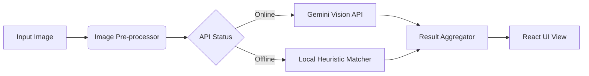

<div align="center">

  <br />
  <div style="background: linear-gradient(135deg, #064e3b 0%, #000000 100%); padding: 20px; border-radius: 24px; width: 100px; height: 100px; display: flex; align-items: center; justify-content: center; margin: 0 auto; border: 1px solid rgba(16, 185, 129, 0.3);">
    <span style="font-size: 60px; color: #10b981;">⌬</span>
  </div>

  <h1 style="font-size: 2.5rem; font-weight: 700; letter-spacing: 0.15em; margin-top: 20px;">
    SYMBOLIZE <span style="color: #10b981;">/</span> CIPHER
  </h1>

  <p style="font-size: 1.1rem; color: #94a3b8; max-width: 550px; line-height: 1.5;">
    A specialized OCR tool for identifying Unicode glyphs and symbols.
    <br/>
    <span style="opacity: 0.7;">Mapping visual geometry to digital character sets.</span>
  </p>

  <p>
    
    
    
  </p>

  <div style="margin-top: 10px;">
    <a href="#demo">Demo</a> • 
    <a href="#architecture">Architecture</a> • 
    <a href="https://github.com/cipher-attack/symbolize/issues">Issues</a>
  </div>
  
</div>

<br />

## ⌬ System Overview

**Symbolize** is an intelligent character recognition tool designed to bridge the gap between handwritten or visual symbols and their Unicode equivalents. Unlike standard OCR, it focuses on the structural properties of glyphs, making it ideal for mathematicians, designers, and developers.

The system uses **Google Gemini 2.0 Flash** for high-accuracy inference, with a built-in **local matching engine** to handle basic lookups without requiring an active API connection.

---

##  Core Functionality

| Feature | Technical Implementation |
| :--- | :--- |
| **Inference Engine** | Multi-modal analysis of image data to extract Unicode & HTML entities. |
| **Local Fallback** | Deterministic symbol matching for environments without internet access. |
| **Performance UI** | Minimalist True Black (`#000000`) interface built with Tailwind CSS. |
| **Architecture** | Type-safe React 19 frontend with Vite for optimized build times. |
| **Grid System** | Fully responsive layout that adapts to mobile and desktop terminals. |

---

##  Technical Architecture

The following flow defines how Symbolize processes input and handles fail-safes between the cloud API and local processing.



---

##  Stack & Tools

- **Frontend:** React 19, TypeScript
- **Styling:** Tailwind CSS (Modern Glassmorphism)
- **Tooling:** Vite, ESLint
- **AI:** Google Generative AI SDK

---

##  Local Setup

### Prerequisites
- Node.js (v18+)
- Google AI Studio API Key (Optional)

### Quick Start
```bash
# Clone the repository
git clone https://github.com/cipher-attack/cipher-symbolize.git

#go to dir
cd cipher-symbolize

# Install and start
npm install
npm run dev
```

---

## 👤 The Architect

<table border="0">
  <tr>
    <td width="140">
      
    </td>
    <td>
      <h3>Biruk Getachew (CIPHER)</h3>
      <p><i>Offensive Security Researcher & Developer</i></p>
      <p>12th-grade student building high-performance tools on mobile/ARM interfaces. Focused on the practical application of LLMs in security and development workflows.</p>
      <p>
        <a href="https://github.com/cipher-attack">GitHub</a> • 
        <a href="https://www.youtube.com/@cipher-attack">YouTube</a> • 
        <a href="https://t.me/cipher_attacks">Telegram</a>
      </p>
    </td>
  </tr>
</table>

---

### Legal Note
Intended for research and educational use. All character recognition is performed on the client-side or via authorized API calls.

<div align="center">
  
</div>
